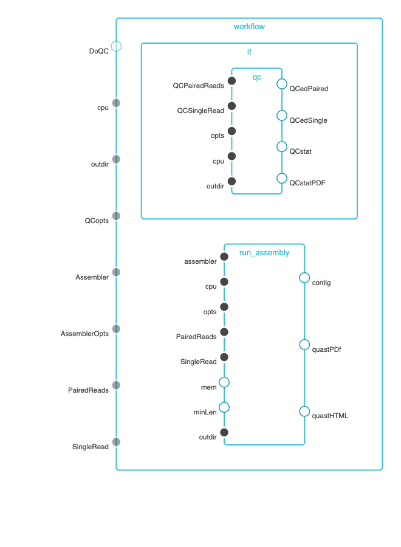

# The Metagenome Assembly Pipeline

## Summary
This workflow take paired-end reads runs reads quailty trimming and filtering by FaQCs, then assembles them with MetaSpades or megahit. 
After assembly, it generates assembly html report by (meta)quast.

## Running Workflow in Cromwell
You should run this on cori. There are three ways to run the workflow.  
1. `SlurmCromwellJtmShifter/`: The submit script will start a jtm-task-manager. The Cromwell send tasks to jtm-task-managers which will manages the tasks running on a computer node and using Shifter to run applications. 
2. `SlurmCromwellShifter/`: The submit script will request a node and launch the Cromwell.  The Cromwell manages the workflow by using Shifter to run applications. 
3. `CronwellSlurmShifter/`: The Cromwell run in head node and manages the workflow by submitting each step of workflow to compute node where applications were ran by Shifter.

Description of the files in each sud-directory:
 - `.wdl` file: the WDL file for workflow definition
 - `.json` file: the example input for the workflow
 - `.conf` file: the conf file for running Cromwell.
 - `.sh` file: the shell script for running the example workflow

## The Docker image and Dockerfile can be found here

```
bioedge/nmdc_mags:withchkmdb
```

You can find more documentation on https://hub.docker.com/r/bioedge/nmdc_mags

## Running Requirements
unknown at this time

## Input files
expects: fastq, illumina, paired-end

## Output files
```
```

## Dependency graph

