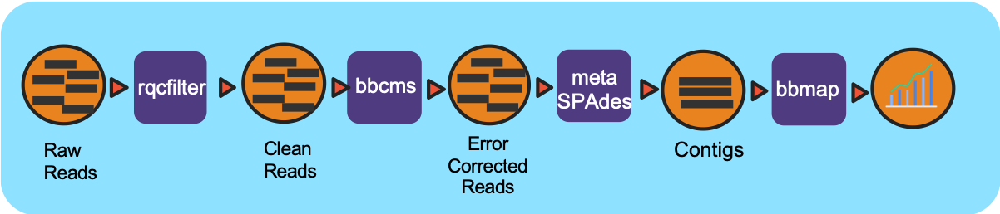

# The Metagenome Assembly Pipeline

## Summary
This workflow take paired-end reads runs reads quailty trimming and filtering by FaQCs, then assembles them with MetaSpades or megahit. 
After assembly, it generates assembly html report by (meta)quast.

## Running Workflow in Cromwell
You should run this on cori.

## The Docker image and Dockerfile can be found here

```
bioedge/nmdc_mags:withchkmdb
```

You can find more documentation on https://hub.docker.com/r/bioedge/nmdc_mags

## Running Requirements
unknown at this time

## Input files
expects: fastq, illumina, paired-end

## Output files
```
```

## Dependency graph

