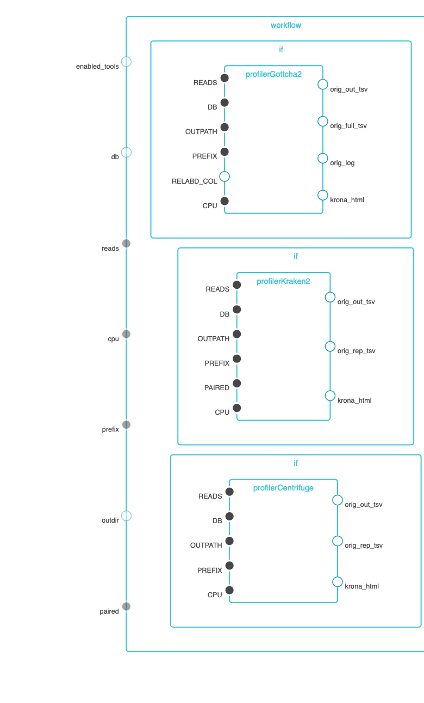

# The Read-based Analysis Pipeline

This workflow is developed for Task-2.1.2. The pipeline takes sequencing files (single- or paired-end) and profiles them using multiple taxonomic classification tools with the Cromwell as the workflow manager.

## Run jobs using cromwell

There is two workflow directories that contain different configurations for Cromwell:
 - `CromwellJtmShifter/`: uses JTM backend.
 - `SlurmCromwellShifter/`: uses local backend.

Description of the files:
 - `ReadbasedAnalysis.wdl`: the WDL file for read-based analysis pipeline.
 - `ReadbasedAnalysisTasks.wdl`: the WDL file for tasks of each tool.
 - `ReadbasedAnalysis_inputs.json`: the example inputs.json file for the pipeline.
 - `ReadbasedAnalysis_cromwell*.conf`: the conf file for running cromwell.
 - `ReadbasedAnalysis.[sh|job]`: the script for running with jobs using JTM or sbatch to slurm.

## Docker image

The docker images for all profilers is at the docker hub: `poeli/nmdc_taxa_profilers:latest`. The `Dockerfile` can be found in `Docker/ReadbasedAnalysis/` directory.

## Inputs

To enable tool(s), set the value of the tool to `true` in `ReadbasedAnalysis.enabled_tools` and specify the path of the database in `ReadbasedAnalysis.db`.

```json
{
  "ReadbasedAnalysis.enabled_tools": {
    "gottcha2": true,
    "kraken2": true,
    "centrifuge": true
  },
  "ReadbasedAnalysis.db": {
    "gottcha2": "/path/to/gottcha2/db",
    "kraken2": "/path/to/kraken2/db",
    "centrifuge": "/path/to/centrifuge/db"
  },
  "ReadbasedAnalysis.reads": [
    "/path/to/read1.fastq.gz",
    "/path/to/read2.fastq.gz"
  ],
  "ReadbasedAnalysis.paired": true,
  "ReadbasedAnalysis.prefix": "test",
  "ReadbasedAnalysis.outdir": "/path/to/sample_test",
  "ReadbasedAnalysis.cpu": 4
}
```

## Workflow

