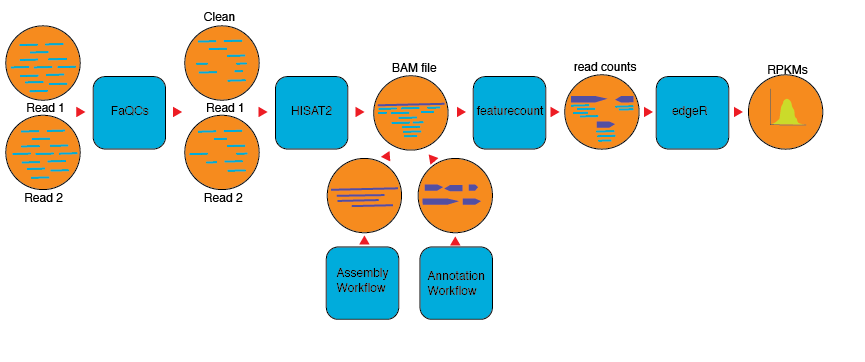

# Metatranscriptomic pipeline

## Summary
This workflow is designed for analyzing metatranscriptomic datasets.

## Running workflow

### In local computer/server with conda
Running workflow in a local computer or server where all the dependencies are installed and in path. cromwell should be installed in the same directory as this file. 

`cd` into the folder and:

```
	$ java -jar cromwell-XX.jar run workflows/metaT.wdl -i  test_data/test_input.json 

```

### In a local computer/server with docker
Running workflow in a local computer or server using docker. cromwell should be installed in the same directory as this file.

```
  java -jar cromwell-XX.jar run workflows/docker_metaT.wdl -i  test_data/test_input.json 

```

###  In cori with shifter and/or JTM

Running workflow in cori with JTM:

The submit script will request a node and launch the Cromwell.  The Cromwell manages the workflow by using Shifter to run applications.

```
java -Dconfig.file=jtm.conf -jar cromwell-XX.jar run -i test_data/test_input.json workflows/shift_metaT.wdl
```

## Docker image

The docker images for all profilers is at the docker hub: `migun/nmdc_metat:latest`. The `Dockerfile` can be found in `Docker/metatranscriptomics/` directory.


## Inputs
expects: fastq, illumina, paired-end
fasta: reference genomes or contigs
gff: reference annotation file
json: json with input

```json
{
    "metaT.projectName":"SRR2126941",
    "metaT.cpu" : 4,
    "metaT.outdir": "test_results",
    "metaT.DoQC" : true,
    "metaT.QCopts" :"-min_L 50 -n 4",
    "metaT.PairedReads":["test_data/BTT_test27_R1.fastq.gz","test_data/BTT_test27_R2.fastq.gz"],
    "metaT.ref_genome": "test_data/test_prok.fna",
    "metaT.ref_gff": "test_data/test_prok.gff"
  }


```
## Workflow


